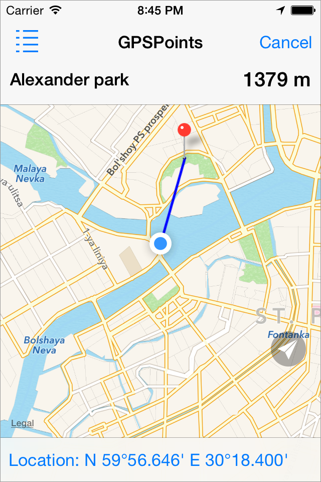
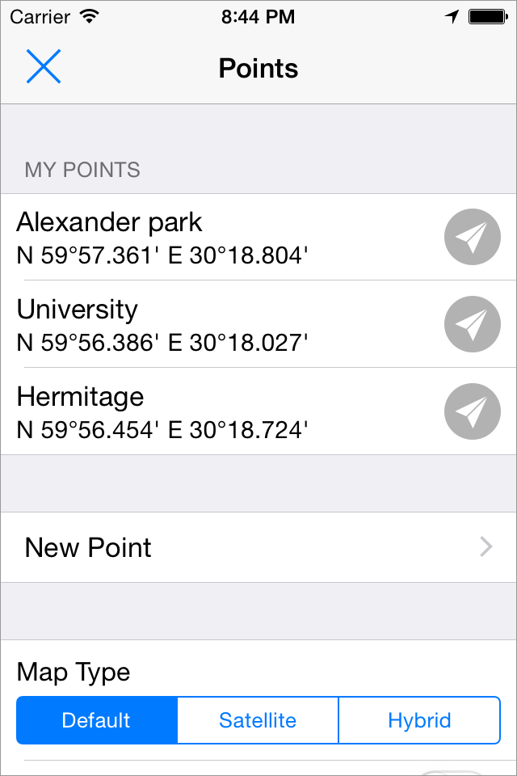

# GPSPoints
Small iOS navigation program
https://itunes.apple.com/en/app/gpspoints-navigator/id980888928

* Demonstrate how to use MapKit.framework
* iOS 5.0 - 8.2 support
* iPhone & iPad support

And it's just useful for me!

# How to use
* Create point by entering gps coordinates or by long tap on map
* Navigate to this point
* See a map with finish point and distance to it

# License
Permission is granted to anyone to use this software for any purpose, including commercial applications

# Contact
Suggestions will be well received

Mail [pigmasha@gmail.com](mailto:pigmasha@gmail.com)
